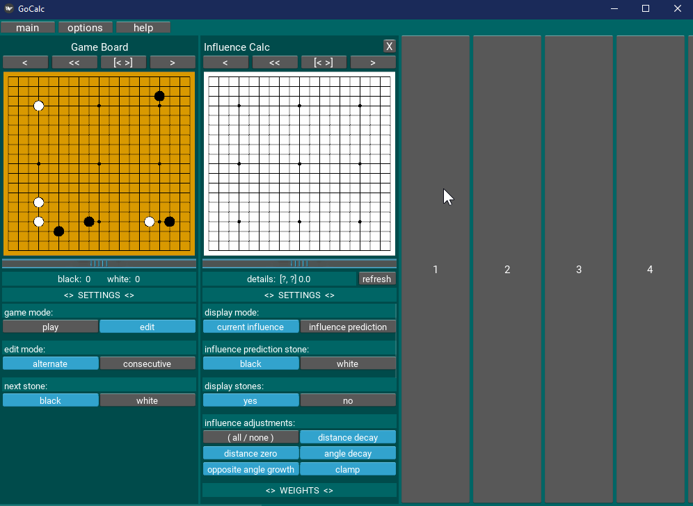
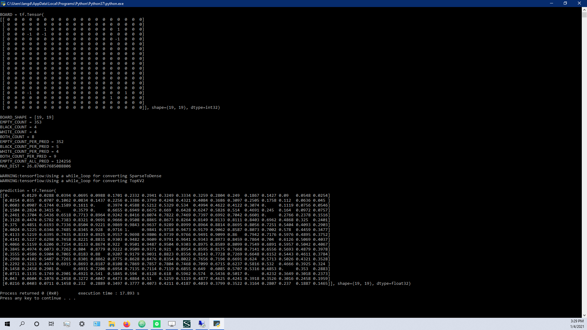
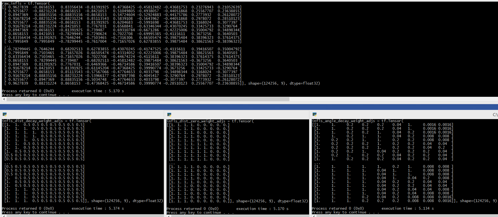

# GoCalc
\
**Overview:**\
\
Developing artificial intelligence to play the board game of Go, where the program's primary purpose is not necessarily be a great Go player, but instead to explain to users why the AI makes the decisions that it does, and explain where the information to make the decisions come from.\
\
Primary external libraries used:  kivy, tensorflow, keras, numpy, pandas, and matplotlib.\
\
\
\
**Current highlight pic/vid (other pics/vids below):**\
\
\
((*vid02*) Demo of Influence Calc panel.  Demonstrates applying, removing, and modifying the AI's Influence model's layers and weights.  (2021-05-17))\
\
\
\
**Notes:**\
\
For task details see this repo's latest project:  Calc Panels v1.\
\
\
\
**other pics/vids:**\
\
\
((*vid01*) Demo of game board interface.  This frontend display is currently not linked to the backend prediction model.  The purpose of this vid is just to demonstrate the development of the user interface.  (2021-01-03))\
\
\
((*pic02*) Current result of influence model's output prediction.  (2021-01-04))\
\
\
((*pic01*) Calculating stone influence per empty position in each predicted move.  (2020-12-31))